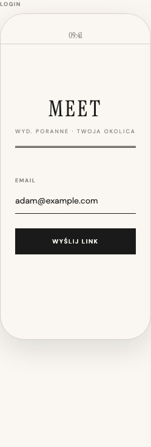
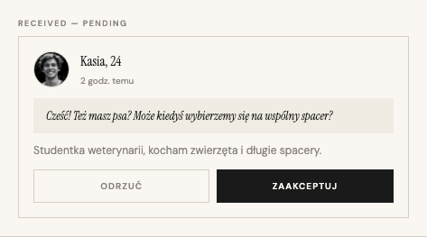
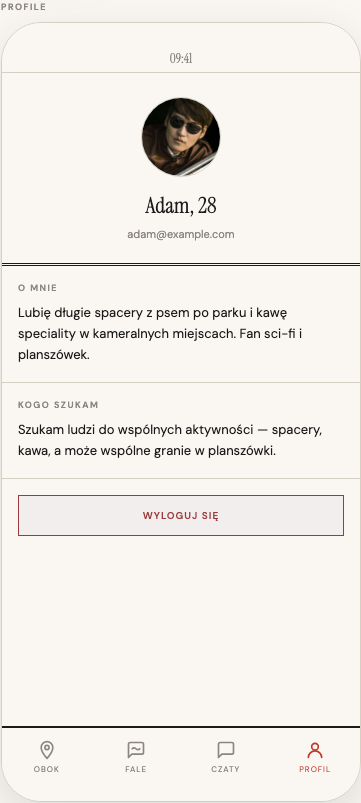

# Blisko

A mobile app for discovering and connecting with people who share your interests, right in your neighborhood.

<p align="center">
  
  
  
</p>

**[Browse the Design Book →](https://design.meetapp.work)**

## Stack

- **Mobile:** Expo + React Native
- **Backend:** Hono + tRPC
- **Database:** PostgreSQL (Supabase) + Drizzle ORM
- **Auth:** Better Auth (magic link)

## Structure

```
apps/mobile      # iOS/Android app
apps/api         # Backend API
apps/design      # Design book
packages/shared  # Shared validators & types
```

## Development

```bash
pnpm install
pnpm dev
```
